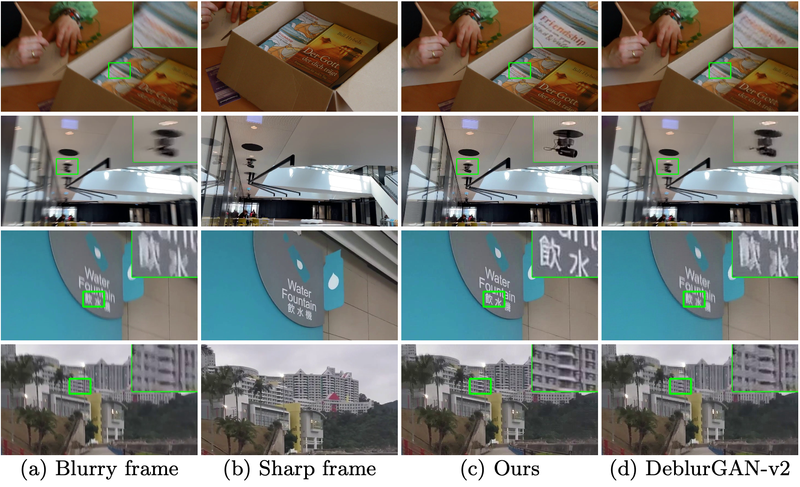
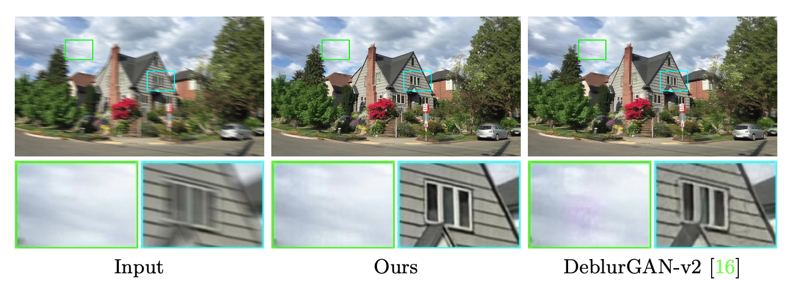

# Video Deblurring by Fitting to Test Data

[Paper]()  |  [Project Page](https://xuanchiren.com/pub/blur) | [Video]()

Tensorflow implementation for this paper by [Xuanchi Ren*](https://xuanchiren.com), Zian Qian*, [Qifeng Chen](https://cqf.io/)

\* indicates equal contribution

The dataset and the code for training will be released.

## Overview
We present a novel approach to video deblurring by fitting a deep network to the test video. One key observation is that some frames in a video with motion blur are much sharper than others, and thus we can transfer the texture information in those sharp frames to blurry frames. Our approach heuristically selects sharp frames from a video and then trains a convolutional neural network on these sharp frames. The trained network often absorbs enough details in the scene to perform deblurring on all the video frames. As an internal learning method, our approach has no domain gap between training and test data, which is a problematic issue for existing video deblurring approaches. The conducted experiments on real-world video data show that our model can reconstruct clearer and sharper videos than state-of-the-art video deblurring approaches.

Results on our real-world blurry dataset:

Results on GoPro dataset:

